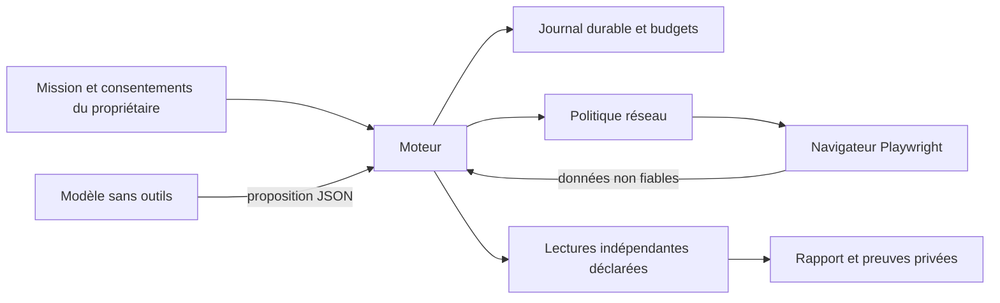

# Architecture locale et contrat de preuve

Produit : **agents simulant une démarche de QA humain**, jamais véritables testeurs humains. La démarche (persona, exploration, hypothèse, contre-exemple, reproduction, revue) peut être simulée ; la véracité des résultats ne dépend pas d'une formule du modèle.

`store.mjs` gère lock, chaîne d'empreintes et journal fsync. Le journal est autoritaire ; pas de cache réinitialisant les compteurs. Troncature/configuration différente : arrêt et revue. Les empreintes détectent une altération accidentelle ; ce n'est pas une signature contre un administrateur hostile. Limite du journal 64 Mio ; un seul processus par campagne.

`policy.mjs` décide à partir des origines, chemins exacts, méthodes, quotas de requêtes et corps consentis. GET est un droit déclaré, pas une preuve d'absence d'effet. Le propriétaire doit connaître ses endpoints. Les POST GraphQL de lecture sont refusés dans cette version ; pas d'exception implicite. Par défaut 500 requêtes admises persistantes, configurable explicitement. Redirects, service workers, WebSockets, téléchargements et réseau hors origine sont bloqués dans l'adaptateur.

`browser.mjs` produit DOM/états, captures masquées et traces réseau réduites sans headers/corps. Références = handles + snapshot + signature ; contrôle remplacé, caché, occlus ou désactivé : refus. Gestes natifs click/fill/select/slider/upload/scroll/navigation. Upload = contenu fourni par propriétaire, aucun chemin choisi par modèle. Captures masquent tous les champs et les sélecteurs sensibles ; le DOM exclut ces sélecteurs et retire les secrets connus. Les captures et le DOM restent privés : données inconnues et informations d'entreprise ne sont pas anonymisées magiquement. Traces Playwright brutes désactivées car elles peuvent contenir sessions et corps sensibles.

`engine.mjs` écrit l'intention avant le geste, réserve les requêtes avant envoi, ferme ensuite le droit d'écriture et rapproche. Une intention ne se rejoue jamais, même sans requête constatée. Plusieurs requêtes sont possibles pour UN geste, selon caps déclarés. Une préparation locale est journalisée séparément. Après crash pendant préparation : revue, pas reconstruction automatique. Après crash de soumission : réconciliation seule. Un hold empêche toute autre soumission, y compris avec un autre scénario.

`providers.mjs` et `cli-provider.mjs` acceptent fournisseur explicite et quota frais. Gateway : coût maximal réservé avant appel, conservé après erreur. CLI : abonnement explicitement déclaré, appels et quotas persistants, coût monétaire inconnu. Montants en micro-USD entiers. Le gateway doit imposer le cap réel et borner sa sortie ; sans lui pas de garantie de facture. Deux identités de gateways sont testées synthétiquement ; Codex a produit deux décisions réelles, Antigravity a été refusé. Un registre `agents` autorise plusieurs workers choisis par mission, avec budget global et usage par worker ; aucun fournisseur non déclaré ni fallback après erreur.

`report.mjs` sépare intention, contrôles, hypothèses et limites. Un récit ou un toast n'incrémente jamais la couverture métier. Déduplication des hypothèses et checks déterministes par empreinte. Deux lectures de checks du propriétaire permettent des observations de défaut ; une priorité critique reste à revoir hors de l'agent et du rapport automatique.

## Contrat des verdicts

| État | Preuve | Ce qu'il ne signifie pas |
|---|---|---|
| Préparation observée | DOM après geste local, zéro intention | Pas de soumission ni de sauvegarde |
| `attempted` | Intention durable avant geste | Pas de succès ni même de requête certaine |
| `uncertain` | Geste tenté, oracles absents/contradictoires/indisponibles | Pas d'échec certain ; jamais une permission de réessayer |
| `confirmed` | Tous les checks d'une probe métier indépendante passent | Pas de certification au-delà du compte/date/unité/document déclarés |
| `rejected` | Probe positive de refus pour cette opération | Pas simplement HTTP 403 ou absence d'objet |
| `pass/fail` UI | Snapshot ou assertion UI propriétaire | Pas de sécurité serveur |

Le refus avant requête est visible et distinct du toast de réussite dans la preuve UI. Sans oracle indépendant de refus, son verdict serveur reste `uncertain` par choix conservateur. La version ne certifie pas la protection serveur derrière des boutons absents.

## Authentification et rôles

Sessions injectées en mémoire via `privateOptions.roles[role] = {storageState, headers, probeHeaders}` par un bootstrap de confiance utilisant Playwright. Rien n'est fourni au modèle ; cookies/headers/localStorage injectés sont ajoutés aux secrets à masquer. Chaque rôle change de contexte Chromium ; la campagne conserve le même Store et budget. Un login interactif/SSO/MFA automatique n'est pas livré. La CLI publique ne charge aucun fichier de session ni .env ; un intégrateur utilise l'API pour ses comptes de recette. Les probes ont une session indépendante (`probeHeaders`) et doivent être autorisées en lecture. Pas d'export de storageState dans les preuves.

## Contenu hostile

Le modèle reçoit instruction de mission séparée et `untrustedSite`. Cette frontière de prompt aide la compréhension mais n'est pas une sandbox : le contrôle réel est le schéma d'action, l'absence d'outils/secrets et le refus réseau. Les tests injectent une page malveillante et une fausse déclaration de succès. Ils ne mesurent pas la résistance cognitive d'un fournisseur LLM réel. Un site hostile peut manipuler son propre DOM/oracle ; le propriétaire est responsable d'oracles indépendants fiables.
